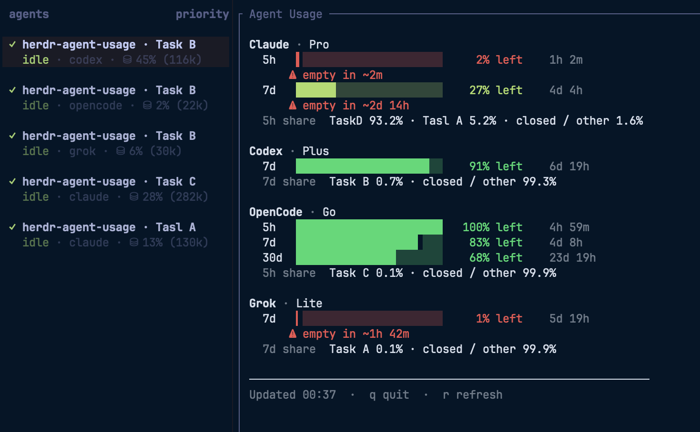

# Agent Usage

[](https://github.com/senna-lang/herdr-agent-usage/actions/workflows/ci.yml)
[](LICENSE)


Monitor context usage and provider rate limits for agents running in [Herdr](https://herdr.dev).



- **Per-pane context meters** — every agent pane's sidebar label shows how much of its context window the session is using (`⛁ 13% (130k)` = 130k tokens, 13% of the window), updated after each completed turn.
- **Provider limit row** — a separate sidebar row shows the shortest account-limit window (`5h 72%`) without crowding the context meter.
- **Account rate-limit windows at a glance** — one live pane shows how much 5h / 7d / 30d allowance is left for Claude, Codex, OpenCode Go, and Grok, with reset countdowns and which open pane is burning it.
- **Low-allowance warnings** — optional toasts fire when a window drops below your thresholds (default 50 / 20 / 10 / 5 % left), before you hit the wall mid-task.
- **Pay-as-you-go API backends** — when a pane runs a direct API key instead of a subscription, there's no plan quota to show. Works with **any** provider a harness can reach (DeepSeek, OpenAI, Together, OpenRouter, Ollama, Bedrock, Vertex, a custom gateway, …), not just the one the screenshot happens to show. Detected across all four harnesses from what each records locally: OpenCode's per-message `providerID`, Codex's `model_provider`, Claude's deployment env (Bedrock / Vertex / Foundry / gateway), and Grok custom models (`~/.grok/config.toml` `[model.*]` `base_url`). The sidebar then names the backend and totals what that pane spent on it (e.g. `deepseek` with `Σ 425k $0.04`), and the Agent Usage pane adds a per-backend block with rolling 24h / 7d / 30d totals for that provider, a per-model breakdown, and which open pane is spending it. Dollar cost is shown when the harness records it (OpenCode today); otherwise the block is token-only.

## Requirements

- **Herdr ≥ 0.7.4**
- **macOS or Linux**
- Agent integrations for reliable session matching (recommended):

```bash
herdr integration install codex
herdr integration install opencode
# Claude Code integration recommended when you use Claude panes
```

## Install

```bash
herdr plugin install senna-lang/herdr-agent-usage
# non-interactive shells (CI, coding agents) need --yes
```

Plugin install does **not** rewrite `~/.config/herdr/config.toml` (sidebar rows, toast delivery, keybindings). Run setup after install:

```bash
herdr plugin action invoke usagebar.setup
# optional: append toast delivery if missing
herdr plugin action invoke usagebar.enable-toast
herdr server reload-config
```

`usagebar.setup` resolves the `usagebar` binary automatically on first run: it builds with the local Go toolchain (≥ 1.25) when available, and otherwise downloads a prebuilt binary from [GitHub Releases](https://github.com/senna-lang/herdr-agent-usage/releases) (macOS / Linux, arm64 / amd64). To build manually instead, run `make build` in the plugin root.

## Let an LLM set it up

Copy the prompt in [docs/LLM-SETUP.md](docs/LLM-SETUP.md) into an LLM coding agent.
The agent can install the plugin and guide you through the remaining setup.

- **Toasts:** The agent must ask for your approval before enabling toast notifications.
- **Keybindings:** The recommended shortcuts are `ctrl+shift+u` to open the limits pane and `ctrl+shift+m` to refresh meters (single chords; no Herdr prefix). If either shortcut is already in use, the agent must ask which shortcut to use instead.

## Quick start

1. Install the plugin and run **setup** (above).
2. Open a workspace with at least one agent pane.
3. Add the sidebar rows printed by `usagebar.setup` to your Herdr config, then run `herdr server reload-config`.
4. After an agent turn completes (or you focus the pane), the sidebar shows provider limit remaining above context usage.
5. Open the limits pane:

```bash
herdr plugin action invoke usagebar.open-limits
```

6. Optional keybindings in **your** `~/.config/herdr/config.toml`:

```toml
[[keys.command]]
key = "ctrl+shift+u"
type = "plugin_action"
command = "usagebar.open-limits"
description = "Agent Usage: open limits pane"

[[keys.command]]
key = "ctrl+shift+m"
type = "plugin_action"
command = "usagebar.refresh"
description = "Agent Usage: refresh sidebar meters"
```

On Mac that is **Control+Shift+U** / **Control+Shift+M** (not Command). Then `herdr server reload-config`.

## Actions

| Action | Command | What it does |
| --- | --- | --- |
| Open limits pane | `usagebar.open-limits` | Split pane with provider windows |
| Refresh meters | `usagebar.refresh` | Recompute sidebar `$limit` and `$context` tokens for the target pane |
| Setup | `usagebar.setup` | Seed plugin config, show sidebar/toast/key snippets, report Herdr toast status |
| Enable toast | `usagebar.enable-toast` | Append `[ui.toast]` only if missing (never overwrites) |
| Check for updates | `usagebar.check-updates` | Check GitHub Releases now and show the release/update instructions |

```bash
herdr plugin action list --plugin usagebar
herdr plugin action invoke usagebar.setup
```

## What you get

| Surface | What it shows |
| --- | --- |
| **Sidebar `$context` row** | Per-pane context usage: `⛁ 13% (130k)` when the window size is known, or the token count alone |
| **Sidebar `$limit` row** | Shortest provider limit window (`5h 72%` remaining), or — on a pay-as-you-go pane — what that pane spent on its backend (`Σ 425k $0.04`, scoped to the pane's session and backend) |
| **Sidebar `$provider` row** | Harness name (`opencode`), or the backend it's actually billing on a pay-as-you-go pane (`deepseek`) |
| **Agent Usage pane** | Subscription providers: plan, usage windows (5h / 7d / 30d), remaining % bars, reset countdown, open-pane token share. Pay-as-you-go backends: the provider's rolling 24h / 7d / 30d totals (all sessions, not just this pane), per-model breakdown, and open-pane spend share |
| **Toasts** (optional) | Remaining-limit warnings at configured thresholds (default 50 / 20 / 10 / 5 % left) |

### Supported agents

| Agent | Sidebar context + limit | Limits pane | Notes |
| --- | --- | --- | --- |
| Claude Code | Yes | Yes | Subscription windows from `~/.claude.json` / statusLine cache. Pay-as-you-go (API key, Bedrock, Vertex, Foundry, gateway) hides those windows and labels the backend from deployment env / settings |
| Codex | Yes | Yes | Context + rate windows from local rollouts; custom `model_provider` panes are pay-as-you-go |
| OpenCode Go | Yes | Yes | Prefer official web usage when `OPENCODE_GO_COOKIE` is set; else local SQLite. Non-`opencode-go` backends (e.g. DeepSeek) show token/cost spend instead of plan windows |
| Grok | Yes | Yes | Context from `signals.json`; SuperGrok credits when auth is present. Custom models (`~/.grok/config.toml` `[model.*]` with `base_url`) are pay-as-you-go and labelled from the endpoint host (openai, ollama, …) |

Percentages in the limits pane are **remaining** (`% left`). Higher is safer.

## Agent Usage pane

- Auto-refreshes every **15s**. Press **`r`** to refresh, **`q`** to quit.
- OpenCode Go may show three windows (**5h / 7d / 30d**). Other providers show whichever usage windows their data sources make available.
- Open pane **token share** is local activity share within the shortest window (including a **closed / other** bucket for usage outside open panes). It is not account quota attribution.
- Sidebar meters update after the agent has **settled** (not while `working`), so they match the last completed turn. If the session cannot be resolved, the `$context` token is cleared rather than showing another session’s numbers.

```bash
herdr plugin action invoke usagebar.open-limits
```

## Configuration

### Sidebar limit row (Herdr 0.7.4+)

Add `$provider` and `$limit` as their own row so the existing context text remains unchanged:

```toml
[ui.sidebar.agents]
row_gap = 0
rows = [
  ["state_icon", "tab", "pane"],
  ["$provider", "$limit"],
  ["$context"],
]
```

`$provider` replaces Herdr's built-in `agent` token: it renders the harness
name (`opencode`) normally, and the backend name (`deepseek`) on a
pay-as-you-go pane instead — Herdr joins row tokens with `·` and has no
separator setting, so the two can't be shown side by side without crowding
the row. This makes the standard display `tab · pane`, `provider · limit`,
then context. Run `herdr server reload-config` after editing. The limit
disappears automatically when the matching provider has no limit data.

### Plugin config

```bash
herdr plugin config-dir usagebar
# → ~/.config/herdr/plugins/config/usagebar/config.toml
```

Created on first `usagebar.setup` (or when missing):

```toml
[notify]
enabled = true
remaining_thresholds = [50, 20, 10, 5]
```

### Herdr toast delivery

Required for notifications to appear on screen:

```bash
herdr plugin action invoke usagebar.enable-toast
herdr server reload-config
```

Or paste manually into `~/.config/herdr/config.toml`:

```toml
[ui.toast]
delivery = "herdr" # or "system" / "terminal"

[ui.toast.herdr]
position = "bottom-left"
```

`usagebar.enable-toast` **appends only when `[ui.toast]` is missing**. Existing toast settings are left alone.

### OpenCode Go official usage (optional)

Set the Cookie request header if you want web-backed numbers from the OpenCode console:

```bash
export OPENCODE_GO_COOKIE='auth=…'
```

Without it, usage is estimated from local `~/.local/share/opencode/opencode.db` (5h rolling, UTC week, calendar month).

### Claude statusLine (optional)

For Claude 5h / 7d windows and toasts, pipe the status line through this plugin. Chain with an existing command rather than replacing it.

```json
{
  "statusLine": {
    "type": "command",
    "command": "bash /path/to/herdr-agent-usage/bin/run-statusline.sh"
  }
}
```

After install, resolve the path with `herdr plugin list` (plugin root under Herdr’s config). `usagebar.setup` prints a ready-to-paste command when `HERDR_PLUGIN_ROOT` is available.

## Rate-limit alerts

Thresholds fire once per window at the configured remaining levels (default **50% / 20% / 10% / 5% left**).

1. Enable toast delivery (`usagebar.enable-toast` or manual snippet).
2. **Claude** — statusLine (above) caches utilization and notifies.
3. **Codex / OpenCode / Grok** — after a settled agent turn, the plugin can display a toast based on the shortest available limit window without the Claude status line.

## Releasing (maintainers)

1. Update `version` in `herdr-plugin.toml`, commit it, and push `main`.
2. Run `scripts/release.sh vX.Y.Z` from a clean, up-to-date `main` checkout.

The script waits for CI on that exact commit before it creates and pushes the
tag. The tag-triggered Release workflow repeats vet, build, test, formatting,
lint, and vulnerability checks before it creates a GitHub Release.

## Data handling

Everything is computed from files that the agents already keep on your machine:

| Harness | Local sources read |
| --- | --- |
| Claude Code | `~/.claude.json`, statusLine cache under `~/.claude/herdr-usagebar/`, `settings.json` (deployment env) |
| Codex | rollout files under `~/.codex/sessions/` |
| OpenCode Go | `~/.local/share/opencode/opencode.db` |
| Grok | `~/.grok/sessions/**/signals.json`, `~/.grok/auth.json` (credentials for the credits fetch), `~/.grok/config.toml` (custom-model base URLs) |

Pay-as-you-go detection is not tied to any one harness: it reads the same
per-harness files above (the backend a session used is already recorded there —
OpenCode's `providerID`, Codex's `model_provider`, Claude's deployment env,
Grok's `config.toml`). No extra data sources, no network calls.

Network requests happen in the following cases:

- `opencode.ai` — only when you set `OPENCODE_GO_COOKIE`
- `grok.com` — only when `~/.grok/auth.json` exists (you ran `grok login`)
- `api.github.com` — on the first pane focus and then at most once every 24 hours, to check this plugin's latest public release. The request has no credentials and sends no usage or session data.

No telemetry, no analytics, or usage/session data is sent. State written by the plugin (config, notification state, update-check state, usage history) stays under `~/.config/herdr/plugins/config/usagebar/` and `~/.claude/herdr-usagebar/`.

## Limitations

- **Not a billing dashboard.** Local transcripts / rollouts / signals (and optional OpenCode web / Grok.com credits) can differ from official consoles (other machines, server-side windows).
- **Herdr core config is not rewritten on install.** Use `usagebar.setup` / `usagebar.enable-toast` or edit by hand.
- **macOS / Linux** only.

## Contributing

Bug fixes and documentation improvements are welcome. See [CONTRIBUTING.md](CONTRIBUTING.md) before starting a larger change.

## License

[MIT](LICENSE)
